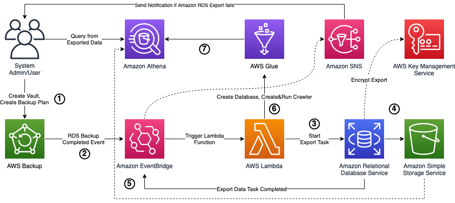
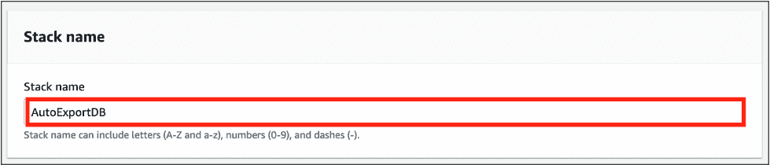
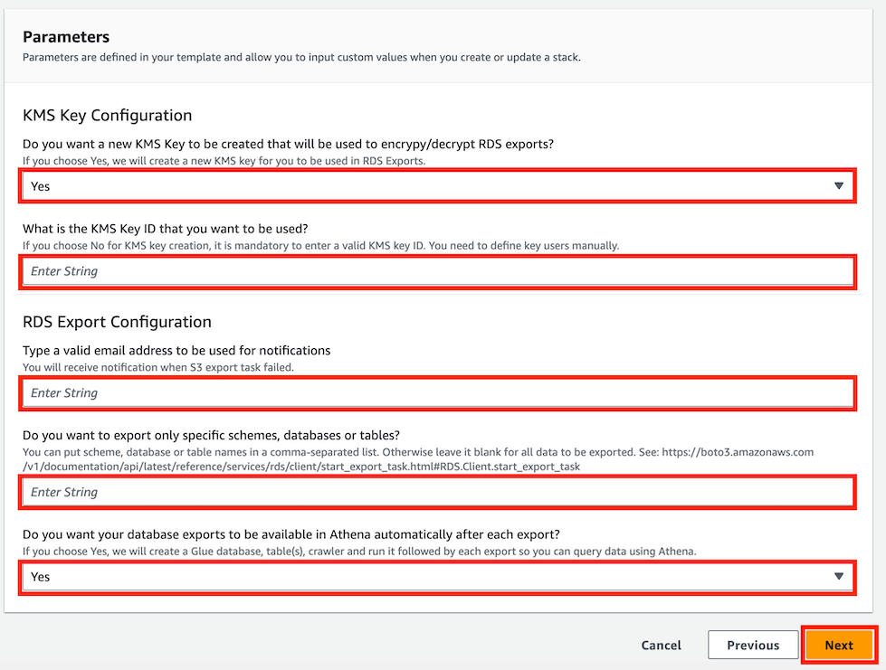
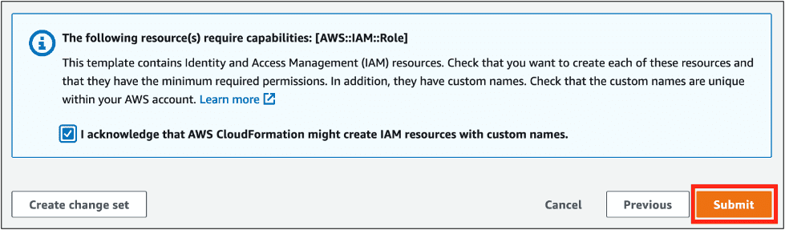
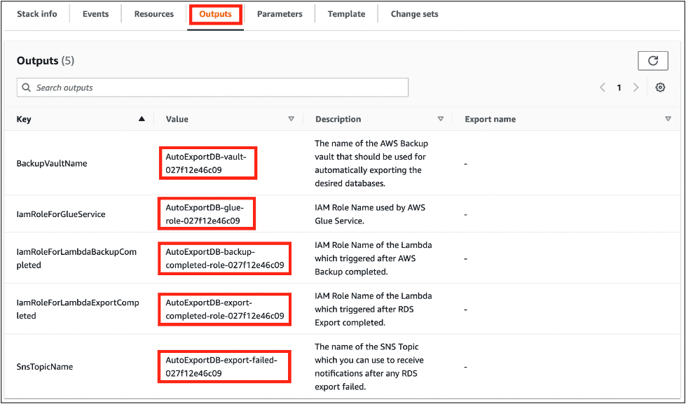

# Reduce RDS Backup costs by automating exports to Amazon S3

This repository contains a CloudFormation template which deploys a serverless event-driven solution that integrates AWS Backup with the Amazon RDS export feature to automate export tasks and enables you to query the data using Amazon Athena without provisioning a new RDS instance or Aurora cluster.

## Overview
The following diagram illustrates the architecture of the solution.

Let’s go through the steps shown in the diagram above:
1.	You create a [backup plan](https://docs.aws.amazon.com/aws-backup/latest/devguide/about-backup-plans.html) which will put database backups to the vault created by the technical solution.
2.	In this solution, we use AWS Backup as a signal source for an [EventBridge rule](https://docs.aws.amazon.com/eventbridge/latest/userguide/eb-rules.html).
3.	The EventBridge rule triggers an AWS Lambda function which starts export task for the database. This solution uses [AWS Key Management Service](https://docs.aws.amazon.com/kms/latest/developerguide/overview.html) (AWS KMS) to encrypt the database exports in Amazon S3.
4.	This solution uses [Amazon Simple Storage Service](https://docs.aws.amazon.com/AmazonS3/latest/userguide/Welcome.html) (Amazon S3) to store the database exports.

This solution also provides an option if you don’t need to query data export using Athena. When deploying the CloudFormation template, you can choose to skip the creation of resources for step 5, 6, and 7.

5.	The EventBridge rule triggers a Lambda function when the export task is completed. It uses [Amazon Simple Notification Service](https://docs.aws.amazon.com/sns/latest/dg/welcome.html) (Amazon SNS) to send email if export task fails.
6.	The Lambda function uses [AWS Glue](https://docs.aws.amazon.com/glue/latest/dg/what-is-glue.html) to create a [database](https://docs.aws.amazon.com/glue/latest/dg/define-database.html), [crawler](https://docs.aws.amazon.com/glue/latest/dg/add-crawler.html) and [runs](https://docs.aws.amazon.com/glue/latest/dg/crawler-running.html) it.
7.	After the crawler successfully runs, you can use Amazon Athena to query the data directly in Amazon S3.

## Usage
To get started, create the solution resources using a CloudFormation template:

1.	Download the [`templates/automate-rds-aurora-export.yaml`](templates/automate-rds-aurora-export.yaml) CloudFormation template to create a new stack.
2.	For **Stack name**, enter a name.

3.	For **KMS Key Configuration**, choose if you want a new KMS key to be created as part of this solution. If you already have an existing KMS key that you want to use, choose **No**.
4.	If you choose **No** for KMS key creation, it is mandatory to enter a valid KMS key ID to be used by the solution. You need to configure key users manually after the solution deployed. Leave this field blank if you chose **Yes** for **KMS Key Configuration**.
5.	Under **RDS Export Configuration**, enter a valid email address to receive notification when an S3 export task failed.
6.	You can enter schema, database, or table names if you want only specific objects to be exported in comma-separated list. Otherwise, leave this field blank for all database objects to be exported. You can find more details about this parameter in the [AWS Boto3 documentation](https://boto3.amazonaws.com/v1/documentation/api/latest/reference/services/rds/client/start_export_task.html#RDS.Client.start_export_task).
7.	If you choose **Yes**, the solution will make exports automatically available in Athena.
8.	Click **Next**.

9.	Accept all the defaults and choose **Next**.
10.	Acknowledge the creation of [AWS Identity and Access Management](https://aws.amazon.com/iam/) (IAM) [resources](https://docs.aws.amazon.com/IAM/latest/UserGuide/resources.html) and click **Submit**. 

The stack creation starts with the status **Create in Progress** and takes approximately 5 minutes to complete.

11.	On the **Outputs** tab, take note of the following resource names:
    * `BackupVaultName`
    * `IamRoleForGlueService`
    * `IamRoleForLambdaBackupCompleted`
    * `IamRoleForLambdaExportCompleted`
    * `SnsTopicName`

12.	If you decided to use an existing KMS key, you need to give the IAM roles you took note of in step 11 access to your existing KMS key. You can do that by using the [AWS Management Console](http://aws.amazon.com/console) [default view](https://docs.aws.amazon.com/kms/latest/developerguide/key-policy-modifying.html#key-policy-modifying-how-to-console-default-view) or [policy view](https://docs.aws.amazon.com/kms/latest/developerguide/key-policy-modifying.html#key-policy-modifying-how-to-console-policy-view).
13.	Check your email inbox and choose **Confirm subscription** in the email from Amazon SNS.  Amazon SNS opens your web browser and displays a subscription confirmation with your subscription ID.

Now you’re ready to store your all RDS or Aurora database exports on Amazon S3 automatically and make them available on Athena. This solution can work for all RDS or Aurora database backups taken using AWS Backup, which uses the backup vault created by the CloudFormation template. 

Before you use this solution, ensure your RDS instance supports [exporting snapshots to Amazon S3](https://docs.aws.amazon.com/AmazonRDS/latest/UserGuide/Concepts.RDS_Fea_Regions_DB-eng.Feature.ExportSnapshotToS3.html). There might be cases when tables or rows can be excluded from the export because using incompatible data types. Review the feature limitations for [RDS](https://docs.aws.amazon.com/AmazonRDS/latest/UserGuide/USER_ExportSnapshot.html#USER_ExportSnapshot.Limits) and [Aurora](https://docs.aws.amazon.com/AmazonRDS/latest/AuroraUserGuide/aurora-export-snapshot.html#aurora-export-snapshot.Limits), test the data consistency between the source database and the exported data from Athena.

## Clean up
To avoid incurring future charges, delete the resources you created:

1.	On the AWS Backup console, [delete the recovery points](https://docs.aws.amazon.com/aws-backup/latest/devguide/gs-cleanup-resources.html#cleanup-backups).
2.	On the Amazon S3 console, [empty the S3 bucket](https://docs.aws.amazon.com/AmazonS3/latest/userguide/empty-bucket.html) created by the CloudFormation template to store the RDS database exports.
3.	On the AWS CloudFormation console, [delete the stack](https://docs.aws.amazon.com/AWSCloudFormation/latest/UserGuide/cfn-console-delete-stack.html) that you created for the solution.